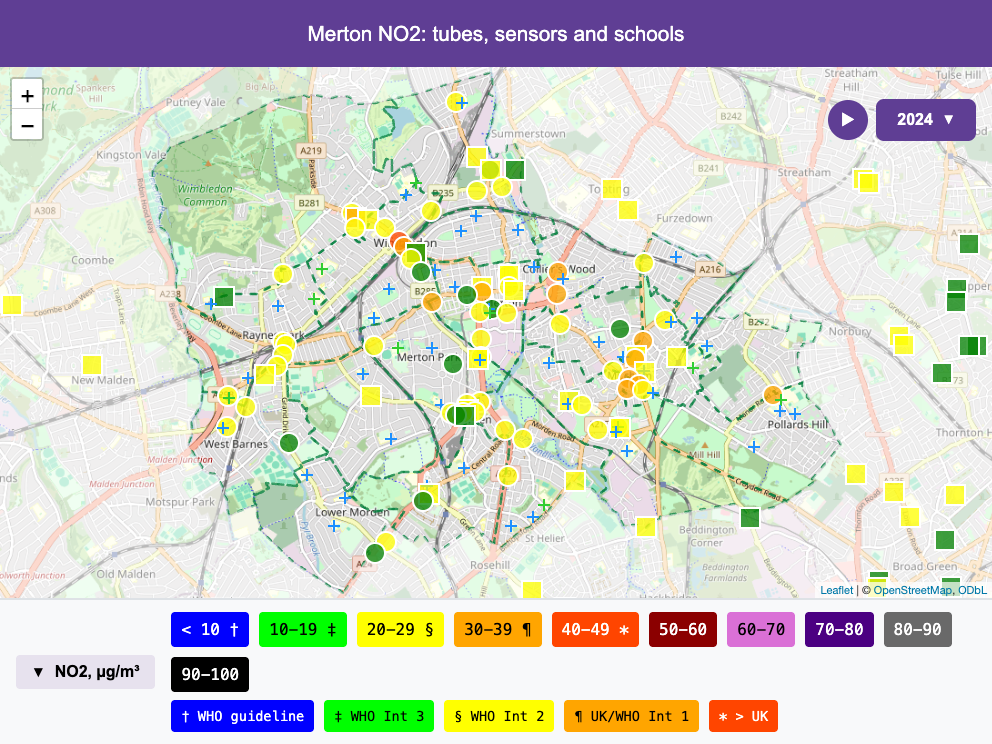

```{r setup, include = FALSE}
knitr::opts_chunk$set(eval = FALSE)
```

A QuickMap map is a stack of **layers** — one per data source. This page
takes you from two layers to hand-built ones.

## In two lines

```{r two-lines}
library(quickmap)
quickmap(list("merton_dt_2018_2024.csv", "schools_Merton.csv"),
         boroughs = "Merton")
```

Two files in a list, one map: diffusion tubes coloured by pollution level,
schools as crosses on top. QuickMap recognises what each file contains and
styles it accordingly — you did not have to say which was which.

## Worked examples

### Add a sensor network

```{r three-layers}
quickmap(
  list(
    "merton_dt_2018_2024.csv",                            # tubes -> circles
    "bl_imperial_annualised_2021_2025_with_missing.Rdata", # sensors -> squares
    "schools_Merton.csv"                                   # schools -> crosses
  ),
  boroughs = "Merton",
  title = "Merton NO2: tubes, sensors and schools"
)
```

Each layer keeps its own symbol shape, so readers can tell a reference
diffusion tube from a low-cost sensor at a glance. The year menu shows
every year found in *any* layer; layers without data for a year simply sit
that year out.



### Name a layer

The legend and controls name layers after their filenames. To choose the
name yourself, build the layer with `from_csv()` instead of a bare path:

```{r named-layer}
quickmap(
  list(
    from_csv("merton_dt_2018_2024.csv", name = "Council tubes"),
    "schools_Merton.csv"
  ),
  boroughs = "Merton"
)
```

This is the general pattern for customising one layer of several: **wrap
that layer, leave the rest alone**.

### Choose the pollutant in an RData layer

Sensor files usually carry several pollutants. `from_rdata()` picks one:

```{r rdata-pollutant}
quickmap(
  from_rdata("bl_imperial_annualised_2021_2025_with_missing.Rdata", "pm25",
             name = "Breathe London"),
  boroughs = "Merton",
  colour_scale = "gla_pm25"
)
```

### Fetch data live with OpenAir

No file at all: the [openair package](https://openair-project.github.io/openair/)
downloads UK monitoring data, and `from_openair()` turns its output
straight into a layer.

```{r net-openair-live}
library(openair)
kc1 <- importUKAQ(site = "kc1", year = 2023)   # North Kensington AURN site
quickmap(
  from_openair(kc1, pollutant = "no2", avg.time = "month",
               source = "aurn", name = "AURN"),
  boroughs = "All"
)
```

`avg.time` uses openair's own vocabulary ("year", "month", "day", "hour").
See the [OpenAir book](https://openair-project.github.io/book/) for
everything `importUKAQ()` can fetch — networks, years, multiple sites.

### Build a layer from your own data frame

Any data frame with a site code, coordinates and a value column can be a
layer — this is how you map data QuickMap has never heard of:

```{r hand-built}
my_sites <- data.frame(
  code = c("A", "B", "C"),
  lat  = c(51.44, 51.45, 51.46),
  lon  = c(-0.17, -0.19, -0.21),
  no2  = c(18, 27, 41)
)
quickmap(qm_layer(my_sites, name = "My survey"), boroughs = "Wandsworth")
```

## How it works

Two rules carry the whole system:

1. **Layer properties live on the layer; map properties live on
   `quickmap()`.** A layer's value column, time column, labels, symbol
   shape and name are set by `qm_layer()` or a `from_*()` wrapper. The
   map's boroughs, colour scale, title, theme and output file are
   `quickmap()` arguments. There is deliberately no
   "vector-of-shapes-per-layer" argument at the map level.
2. **Content decides, not filenames (duck typing).** A CSV with a `School`
   column is a school layer; a CSV with several year columns (`2017`,
   `2018`, …) is a temporal tube layer; an RData file is searched for a
   compatible sensor table. Rename your files freely.

## Full detail

| Function | Builds a layer from | Key arguments |
|---|---|---|
| `from_csv()` | CSV file (tubes or schools) | `pollutant`, `name`, `temporal` |
| `from_rdata()` | RData sensor export | `pollutant`, `name`, `data_object_name` |
| `from_openair()` | openair tibble | `pollutant`, `avg.time`, `source`, `name` |
| `qm_layer()` | any data frame / sf object | `value_col`, `time_col`, `label_col`, `shape`, `name` |
| `qm_meta()` | — | inspect a layer's metadata |

See each function's help page (e.g. `?qm_layer`) for the complete
contract. Cross-cutting behaviour that no single help page owns:

- **Required identity column:** every layer needs a stable site identifier —
  `code` (or legacy `siteCode`) for data frames; CSVs get one generated
  from coordinates or the `Label` column.
- **Column aliases:** `siteCode`→`code`, `year_str`→`time_label`,
  `Latitude`/`Longitude`→`lat`/`lon` are accepted and normalised.
- **Shapes:** measurement layers cycle through solid symbols in the order
  the layers appear (circle, square, triangle, …); contextual layers such
  as schools cycle outline symbols (plus, cross, …). To override, pass
  `data_symbols` to `quickmap()` — e.g. `data_symbols = c("circle",
  "diamond", "cross")`, one per layer. (`qm_layer(shape = )` records a
  shape on the layer but is not yet consumed by `quickmap()` as of
  v0.9.8.)
- **Gotcha — the `Label` column:** in a CSV with a `Label` column, rows
  whose label cell is empty are dropped from the map entirely.
- **Coordinates:** CSVs use British National Grid (`Easting`/`Northing`);
  data frames use WGS84 `lat`/`lon`; sf objects keep their CRS.

## See also

- [Get started](quickmap.html) — the five-minute path.
- `?quickmap` — every map-level parameter.
- [OpenAir book](https://openair-project.github.io/book/) and
  [worldmet](https://openair-project.github.io/worldmet/) — fetching
  measurement and met data (worked extraction examples arrive with the
  *Your data* chapter).
