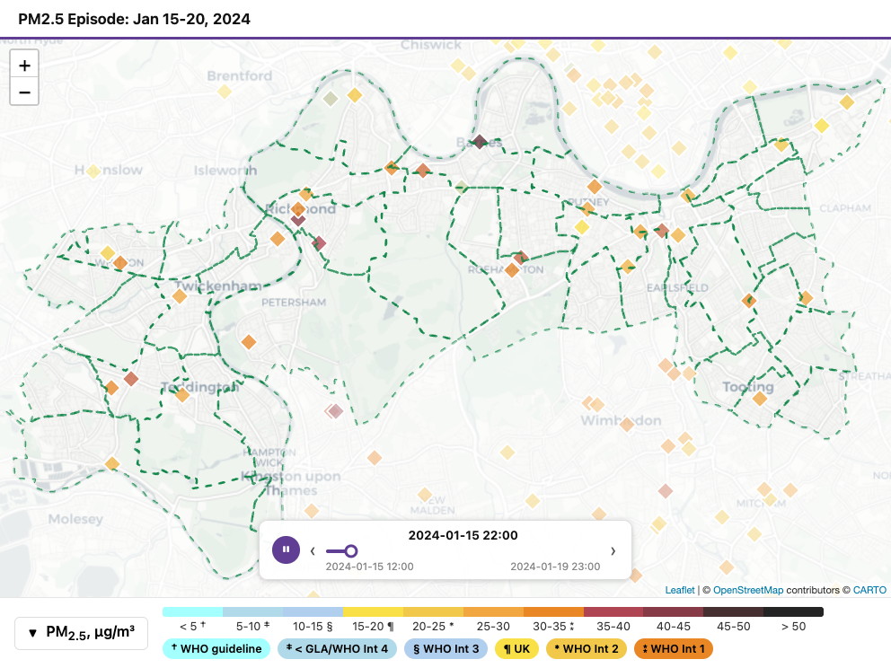

```{r setup, include = FALSE}
knitr::opts_chunk$set(eval = FALSE)
```

QuickMap makes air quality maps from the data you already have — a
diffusion tube file, a sensor-network export, or a live data source such
as an [OpenAir](https://openair-project.github.io/book/) data pull. Maps
are self-contained files, so you can email them or put them on a website,
and compact, fast animations are easy to create.

## 1. Install

Install from GitHub:

```{r install, purl = FALSE}
# install.packages("devtools")            # if you don't have it
devtools::install_github("ngnrfsk/quickmap")
```

> While the repository is private, `install_github()` needs a GitHub
> personal access token: create one at github.com → Settings → Developer
> settings, then run `Sys.setenv(GITHUB_PAT = "your-token")` first. This
> step disappears when the package is released.

## 2. Make a simple map

```{r first-map, purl = FALSE}
library(quickmap)                           # load the quickmap library
quickmap(
  "~/my_data/wandsworth_2017_2024_csv.csv", # diffusion tube data
  boroughs = "Wandsworth"                   # the borough boundary to draw
)
```

To make a map, `quickmap()` needs two things: the measurement data, and
which borough boundary to draw. The data here is an ordinary diffusion
tube spreadsheet saved as CSV:

| Easting | Northing | 2017 | 2018 | ... | 2024 | Label |
|---------|----------|------|------|-----|------|-------|
| 528900  | 172431   | 33   | 31   | ... | 15.9 | 11b Elmbourne Road |
| 530129  | 177727   |      | 49   | ... | 22.9 | 1 Nine Elms |

*Minimum required: `Easting`, `Northing` and at least one year column.
Anything else is optional. (Full input specifications: the* Your data
*chapter.)*

QuickMap converts the coordinates, colours each site by the WHO NO2
bands, draws the borough boundary, and writes `aq_maps/quickmap.html` —
a single self-contained file. Open it in any browser, attach it to an
email, or put it on a website (it does need an internet connection to
download the background map).


## 3. Save typing: tell QuickMap where your data lives

Optional, but worth doing once: if your data files sit in one folder, set
`DATA_PATH` and use bare filenames everywhere:

```{r datapath, purl = FALSE}
Sys.setenv(
  DATA_PATH = "~/my_data"                  # folder where your data lives
)
quickmap(
  "wandsworth_2017_2024_csv.csv",          # now just the filename
  boroughs = "Wandsworth"
)
```

## 4. Reading the map

- **Symbols** are monitoring sites, coloured by pollution level — green
  is good, red is bad. Hover for details.
- **The legend** (along the bottom) names each colour band. Click its
  header to collapse it.
- **The time slider** (bottom of the map) appears because your CSV had
  several year columns. Drag it, step with ‹ ›, or press play to animate.
- **The banner** (top) is the map's title — added next.

## 5. Add a title and choose the file name

Maps usually need a title for the banner, and a file name you'll
recognise later:

```{r step-further}
library(quickmap)                          # (already loaded if you followed above)
quickmap(
  "wandsworth_2017_2024_csv.csv",          # same data
  boroughs    = "Wandsworth",
  title       = "Wandsworth NO2, 2017-2024", # banner text
  output_file = "wandsworth_no2.html"        # file written to aq_maps/
)
```

## 6. Make a sophisticated animation

The same call scales from eight annual frames to a full pollution
episode. This maps five days of hourly sensor data — 108 time steps —
and starts playing by itself:

```{r animation}
quickmap(
  from_rdata("episodeJan15-20_2024_sf_all.Rdata", # hourly sensor export
             "pm25",                              # pollutant to map
             name = "Sensors"),                   # layer name for the map
  boroughs     = c("Wandsworth", "Richmond"),     # two boundaries
  colour_scale = "stripes_pm25",                  # a PM2.5 colour scale
  title        = "PM2.5 Episode: Jan 15-20, 2024",
  output_file  = "episode.html",
  autoplay     = TRUE,                            # play on open
  play_speed   = 500                              # milliseconds per hour
)
```



Above 50 time steps QuickMap automatically switches to a compact storage
format, so even this five-day hourly animation stays around 1 MB — small
enough to email. (An animated wind overlay can ride on top — see the
*Wind* chapter.)

## Where next

- **[Layers](layers.html)** — put tubes, sensors and schools on one map.
- **Function help** — `?quickmap` lists every parameter.
- **Fetching data with OpenAir** — no data file yet? The
  [OpenAir project](https://openair-project.github.io/book/) can download
  UK monitoring data for you, and QuickMap maps it directly (worked
  examples coming in the *Your data* chapter).
