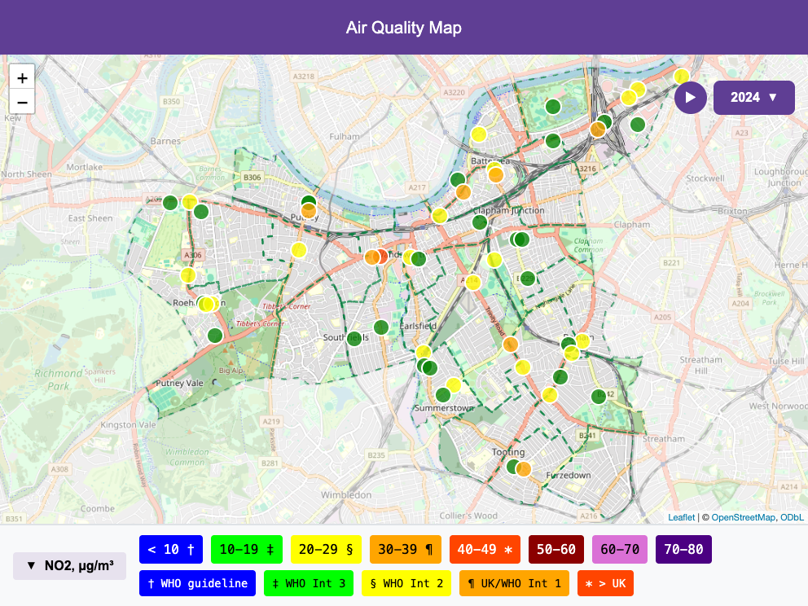

```{r setup, include = FALSE}
knitr::opts_chunk$set(eval = FALSE)
```

QuickMap turns air quality data you already have — a diffusion tube CSV, a
sensor-network export, a live [OpenAir](https://openair-project.github.io/book/)
data pull — into a professional interactive map you can email or publish.
No deep R knowledge required: two lines produce a usable map, every extra
parameter is optional, and the rest of the manual adds them one at a
time. Five minutes from here you will have made your first map.

## 1. Install

QuickMap is not yet on CRAN. Install it from GitHub:

```{r install, purl = FALSE}
# install.packages("devtools")   # if you don't have it
devtools::install_github("ngnrfsk/quickmap")
```

> While the repository is private, `install_github()` needs a GitHub
> personal access token: create one at github.com → Settings → Developer
> settings, then run `Sys.setenv(GITHUB_PAT = "your-token")` first. This
> step disappears when the package is released.

## 2. Tell QuickMap where your data lives

You can always pass full file paths. But if your data files sit in one
folder, set `DATA_PATH` once and use bare filenames everywhere:

```{r datapath, purl = FALSE}
Sys.setenv(DATA_PATH = "~/path/to/your/data")
```

## 3. Your first map — two lines

```{r first-map}
library(quickmap)
quickmap("wandsworth_2017_2024_csv.csv", boroughs = "Wandsworth")
```

That's it. QuickMap reads the CSV (diffusion tube sites with Easting,
Northing and one column per year), converts the coordinates, colours each
site by the WHO NO2 bands, draws the borough boundary, and writes
`aq_maps/quickmap.html` — a single self-contained file. Open it in any
browser, attach it to an email, or put it on a website; it needs no
internet connection beyond the background map tiles.



## 4. Reading the map

- **Markers** are monitoring sites, coloured by pollution level — green is
  good, red is bad. Hover for details.
- **The legend** (along the bottom) names each colour band. Click its
  header to collapse it.
- **The year menu** (the play button and year list on the map) appears
  because your CSV had several year columns. Pick a year, or press play to
  animate.
- **The banner** (top) is the map's title — you'll customise it in a
  moment.

## 5. One step further

Each argument below is optional and does one visible thing:

```{r step-further}
quickmap(
  "wandsworth_2017_2024_csv.csv",
  boroughs    = "Wandsworth",
  title       = "Wandsworth NO2, 2017-2024",   # banner text
  output_file = "wandsworth_no2.html"          # choose the file name
)
```

This is the whole QuickMap idea: start with two lines, add one parameter
at a time, stop whenever the map is good enough.

## Where next

- **[Layers](layers.html)** — put tubes, sensors and schools on one map.
- **Function help** — `?quickmap` lists every parameter.
- **Fetching data with OpenAir** — no data file yet? The
  [OpenAir project](https://openair-project.github.io/book/) can download
  UK monitoring data for you, and QuickMap maps it directly (worked
  examples coming in the *Your data* chapter).
