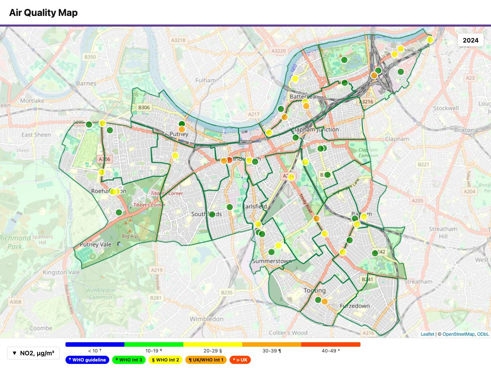

```{r setup, include = FALSE}
knitr::opts_chunk$set(eval = FALSE)
```

Every QuickMap map is a **single self-contained HTML file** — all code
and data inside, nothing to install for the person receiving it. That
makes sharing simple: the file *is* the product.

## 1. Email it

The file you named in `output_file` attaches to an email like any
document. Sizes stay
email-friendly: a typical annual map is well under 1 MB, and even a
108-step hourly animation is about 1 MB (the compact storage format —
[Time and animation](time.html)). The recipient double-clicks and the
map opens in their browser, fully interactive. One dependency: an
internet connection, for the background map tiles.

## 2. Put it on a website

The same file uploads to any web space — no server logic needed. The
pages of this manual embed QuickMap files exactly that way.

## 3. Export a JPG for documents

Reports and slides need still images:

```{r export}
library(quickmap)                          # load the quickmap library
quickmap(
  "tubes_wandsworth.csv",
  boroughs      = "Wandsworth",
  display_times = "2024",                  # one step -> one image
  export_image  = c(1200, 900)             # JPG width x height, pixels
)
```



- `export_image = TRUE` uses the default 1200×1200.
- Text, legend and symbols scale with the image size — a 2400px poster
  export is as legible as a 700px thumbnail.
- Several selected time steps produce one JPG per step.
- The interactive HTML is written as well — the JPG is an extra, not a
  replacement. Wind overlays are omitted from stills.

## See also

- [Get started](quickmap.html) step 6 — export in the build-up.
- [Time and animation](time.html) — the compact format that keeps
  animations email-sized.
